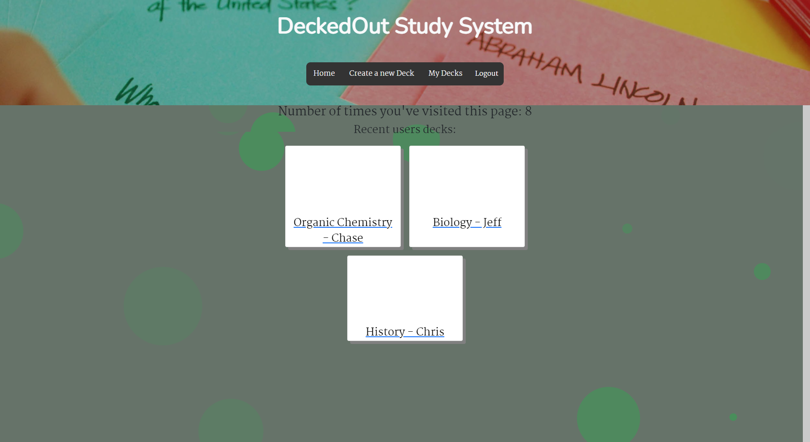
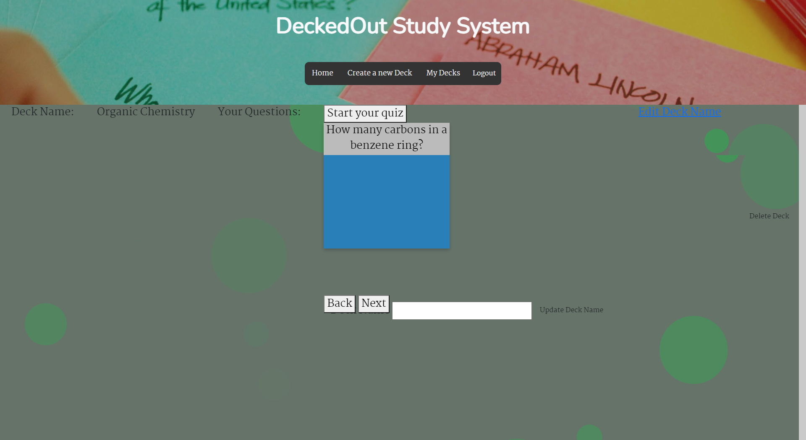
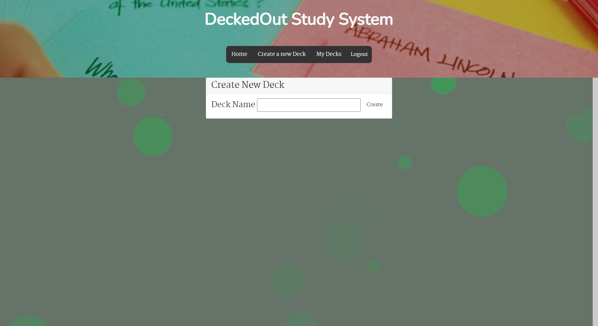

# DeckedOut

## Description
Are you in school, college or maybe a boot camp course? Is studying something that causes you stress and makes you cringe just at the thought of making a stack of index cards. Well have no fear! DeckedOut is here to help! With our interactive platform you can create multiple study lessons and create all the note cards you could ever need all in one place! With our DeckedOut platform studying just because more exciting!

## Table of Contents
- [Installation](#installation)
- [Usage](#usage)
- [Credits](#credits)
- [License](#license)

## Installation
There is no installation requirement when utilizing this project. By following the link below in the Usage section you can start your new study journey with us at DeckedOut!

## Usage
When utilizing our DeckedOut platform follow this link to our deployed project on heroku https://deckedout-penn.herokuapp.com/ !

## Credits

DeckedOut group collaborators are: 
Chase Murtaugh https://github.com/Daelso
Lia O'Brein https://github.com/liaobrien
Ken Bentley https://github.com/kbentley7
Aaron Donelson https://github.com/addonelson

## License
- MIT License

Copyright (c) [2021] [Aaron Donelson, Chase Murtaugh, Lia O'Brien, Kenneth Bentley]

Permission is hereby granted, free of charge, to any person obtaining a copy of this software and associated documentation files (the "Software"), to deal in the Software without restriction, including without limitation the rights to use, copy, modify, merge, publish, distribute, sublicense, and/or sell copies of the Software, and to permit persons to whom the Software is furnished to do so, subject to the following conditions:

The above copyright notice and this permission notice shall be included in all copies or substantial portions of the Software.

THE SOFTWARE IS PROVIDED "AS IS", WITHOUT WARRANTY OF ANY KIND, EXPRESS OR IMPLIED, INCLUDING BUT NOT LIMITED TO THE WARRANTIES OF MERCHANTABILITY, FITNESS FOR A PARTICULAR PURPOSE AND NONINFRINGEMENT. IN NO EVENT SHALL THE AUTHORS OR COPYRIGHT HOLDERS BE LIABLE FOR ANY CLAIM, DAMAGES OR OTHER LIABILITY, WHETHER IN AN ACTION OF CONTRACT, TORT OR OTHERWISE, ARISING FROM, OUT OF OR IN CONNECTION WITH THE SOFTWARE OR THE USE OR OTHER DEALINGS IN THE SOFTWARE.

## Badges

## Features
Our Project has full CRUD for decks! This project also allows you to create your own flash cards!

## Tests
To test our application. Try adding, editing and deleting decks. For Cards try to add a card. 
When viewing the cards test out the "Next" and "Back" buttons which will allow you to easily navigate through all of your questions and answers for any and all decks of cards you create!
